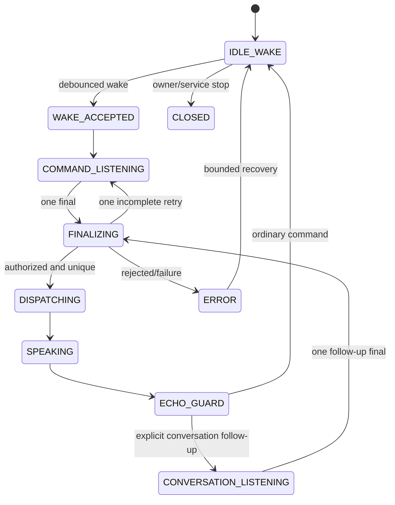

# Sage Commander 1.26.0 speech-state architecture

## States

| State | Meaning | Valid next states |
|---|---|---|
| `IDLE_WAKE` | Passive wake detection; no command is authorized. | `WAKE_ACCEPTED`, `COMMAND_LISTENING`, `ERROR`, `CLOSED` |
| `WAKE_ACCEPTED` | One debounced wake has created an authorized turn. | `COMMAND_LISTENING`, `ERROR`, `CLOSED` |
| `COMMAND_LISTENING` | Final command capture for the current turn. | `FINALIZING`, `COMMAND_LISTENING` (one retry), `ERROR`, `CLOSED` |
| `FINALIZING` | Candidates are normalized, ranked, deduplicated, and source-checked. | `DISPATCHING`, `COMMAND_LISTENING` (one retry), `ERROR`, `CLOSED` |
| `DISPATCHING` | The one executable transcript is routed. | `SPEAKING`, `CONVERSATION_LISTENING`, `IDLE_WAKE`, `ERROR`, `CLOSED` |
| `SPEAKING` | Sage TTS is active and its normalized fingerprint is retained. | `ECHO_GUARD`, `CLOSED`, `ERROR` |
| `ECHO_GUARD` | Short temporal/acoustic guard rejects Sage TTS reflections. | `CONVERSATION_LISTENING`, `IDLE_WAKE`, `CLOSED`, `ERROR` |
| `CONVERSATION_LISTENING` | Exactly one explicit follow-up turn is captured. | `FINALIZING`, `SPEAKING`, `IDLE_WAKE`, `CLOSED`, `ERROR` |
| `CLOSED` | Recognition lifecycle intentionally stopped. | `IDLE_WAKE` only through an explicit restart. |
| `ERROR` | Failure recorded with stage and reason. | `IDLE_WAKE`, `CLOSED` |

## Core invariants

1. Every wake and command turn receives a unique monotonic turn ID.
2. A turn can acquire the executable-final latch once. Partials update UI only.
3. A callback is actionable only when its recognizer generation matches the active generation.
4. A completed turn remains completed; late callbacks are diagnostics, never commands.
5. Identical normalized finals inside the configurable deduplication window are rejected.
6. Identical wakes inside the wake debounce window create one wake event.
7. During active media playback, only a new valid wake or push-to-talk authorizes capture.
8. Recent Sage TTS fingerprints and callbacks inside the echo guard are rejected and counted.
9. Incomplete recognition receives at most one bounded retry.
10. Conversation follow-up is opened from one explicit post-speech transition; delayed callbacks cannot reopen it repeatedly.

## Turn sequence

## Diagnostic record

Each callback record carries raw candidates, selected candidate, confidence, normalization, turn ID, callback generation, match, route, source classification, and rejection reason. Source classification distinguishes likely user speech, recent Sage TTS, and untrusted device media. Push-to-talk is always available and creates an explicitly authorized command turn.

## Media capture policy

When a readable active MediaSession reports playback, Sage treats speaker output as untrusted. An authorized wake or push-to-talk may temporarily pause or duck media while the command is captured; Sage records whether it changed playback and restores that prior state afterward. Unsolicited finals during playback are rejected before dispatch.
